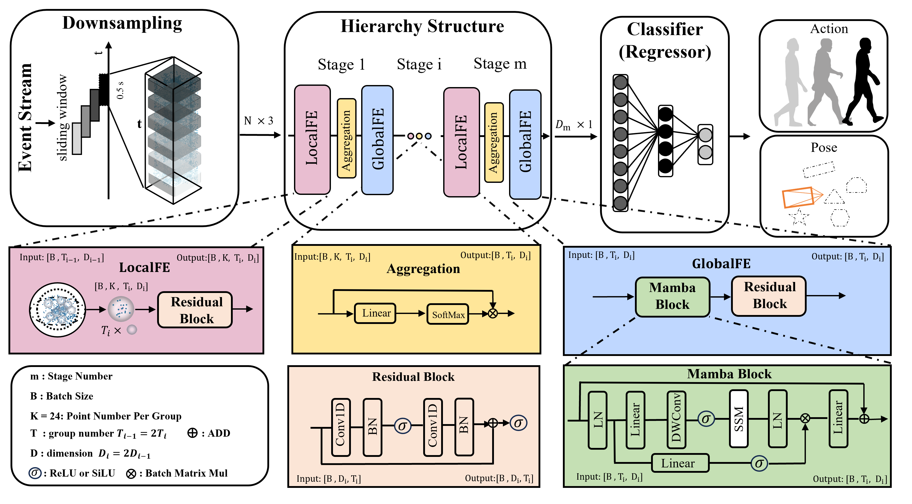

## [Rethinking Efficient and Effective Point-based Networks for Event Camera Classification and Regression: EventMamba](https://arxiv.org/abs/2405.06116)

### Installation

    conda create -n eventmamba python=3.8
    conda activate eventmamba
    conda install pytorch==2.1.0 torchvision==0.16.0 torchaudio==2.1.0 pytorch-cuda=12.1 -c pytorch -c nvidia
    conda install h5py,tqdm,scikit-learn,tensorboard
    pip install spikingjelly
    pip install mamba-ssm
    install the cuda kernel: https://github.com/erikwijmans/Pointnet2_PyTorch
    
### Usage
1. Prepare the data:

        cd dataprocess
        python generate_xxx.py

2. Put the train.h5 and test.h5 to ./data/xxx/:

3. Modify the num_class, data_path, log_name and others.

4. Run the train script:
    
    For action recognition:
        
        python train_classification.py
    For camera pose relocalization:

        python train_odometry.py
    For eye tracking task:

        python train_eye_tracking.py

### Download

| Dataset    | Split    | data, log and pretrained model |
| ---------- | -------- | -------- |
| DVSGesture | offical  |   DOWNLOAD  |
| DailyDVS   | filename | DOWNLOAD     |
| DVSAction  | offical  | DOWNLOAD     |
| HMDB51-DVS     | filename     | DOWNLOAD     |
| UCF101-DVS     | filename    | DOWNLOAD     |
| HMDB51-DVS | sliding window     | DOWNLOAD     |
| UCF101-DVS | sliding window     | DOWNLOAD     |
| THU-CHL    | offical     | DOWNLOAD     |
| IJRR       |   sliding window   | DOWNLOAD     |
| 3ET        | offical     | DOWNLOAD     |
    
### Citation
If you find our work useful in your research, please consider citing:

    @article{ren2024rethinking,
    title={Rethinking Efficient and Effective Point-based Networks for Event Camera Classification and Regression: EventMamba},
    author={Ren, Hongwei and Zhou, Yue and Zhu, Jiadong and Fu, Haotian and Huang, Yulong and Lin, Xiaopeng and Fang, Yuetong and Ma, Fei and Yu, Hao and Cheng, Bojun},
    journal={arXiv preprint arXiv:2405.06116},
    year={2024}
    }
and this paper is an expansion of our previous two works [TTPOINT](https://dl.acm.org/doi/abs/10.1145/3581783.3612258?casa_token=z72pohcxZTAAAAAA:pO42EmMVOEp-8PJPx4WBUwJyjrs-K2Z7lkWbZsanCTF72u763LuxdWNPYAXuTKUT4g82yPgPgLbLH6I) and [PEPNet](https://openaccess.thecvf.com/content/CVPR2024/html/Ren_A_Simple_and_Effective_Point-based_Network_for_Event_Camera_6-DOFs_CVPR_2024_paper.html):

    @inproceedings{ren2023ttpoint,
    title={Ttpoint: A tensorized point cloud network for lightweight action recognition with event cameras},
    author={Ren, Hongwei and Zhou, Yue and Fu, Haotian and Huang, Yulong and Xu, Renjing and Cheng, Bojun},
    booktitle={Proceedings of the 31st ACM International Conference on Multimedia},
    pages={8026--8034},
    year={2023}
    }
    @inproceedings{ren2024simple,
    title={A Simple and Effective Point-based Network for Event Camera 6-DOFs Pose Relocalization},
    author={Ren, Hongwei and Zhu, Jiadong and Zhou, Yue and Fu, Haotian and Huang, Yulong and Cheng, Bojun},
    booktitle={Proceedings of the IEEE/CVF Conference on Computer Vision and Pattern Recognition},
    pages={18112--18121},
    year={2024}
    }    

### Acknowledgment
Thanks to the previous works, PointNet, PointNet++, PointMLP and STNet.    